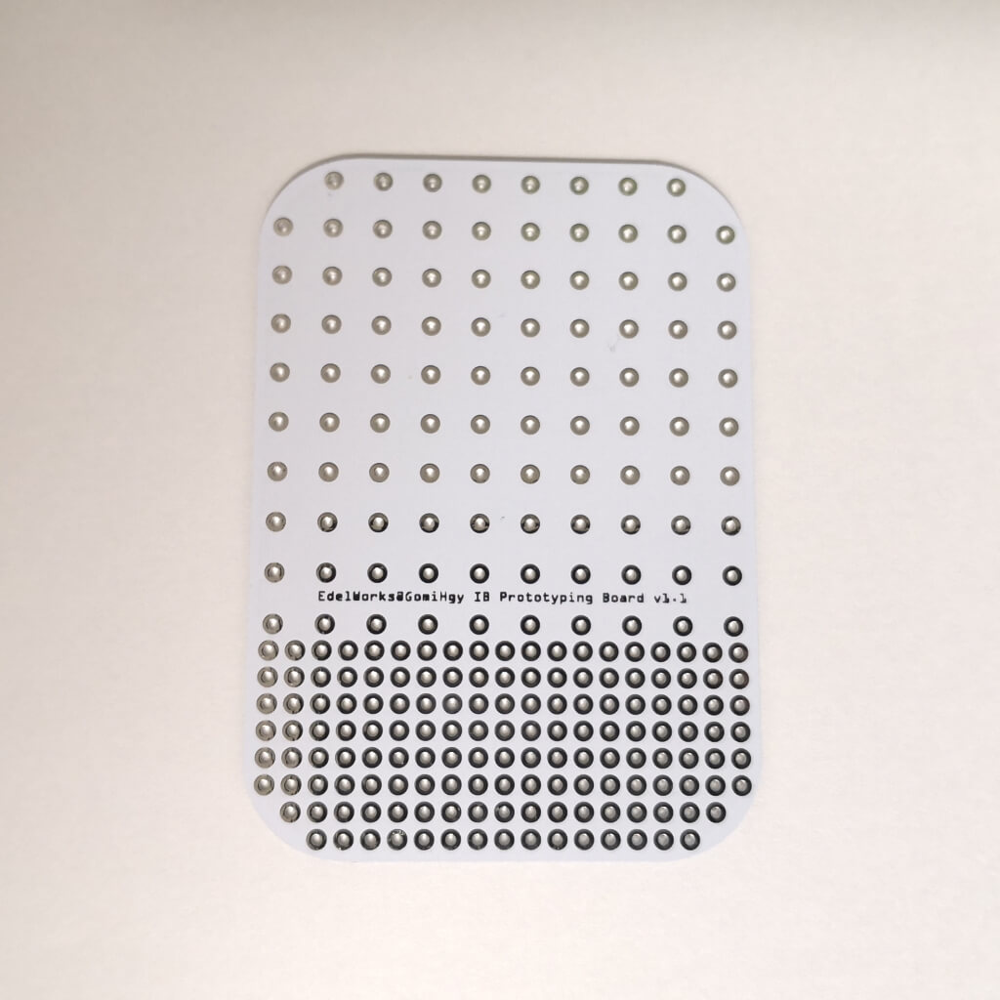
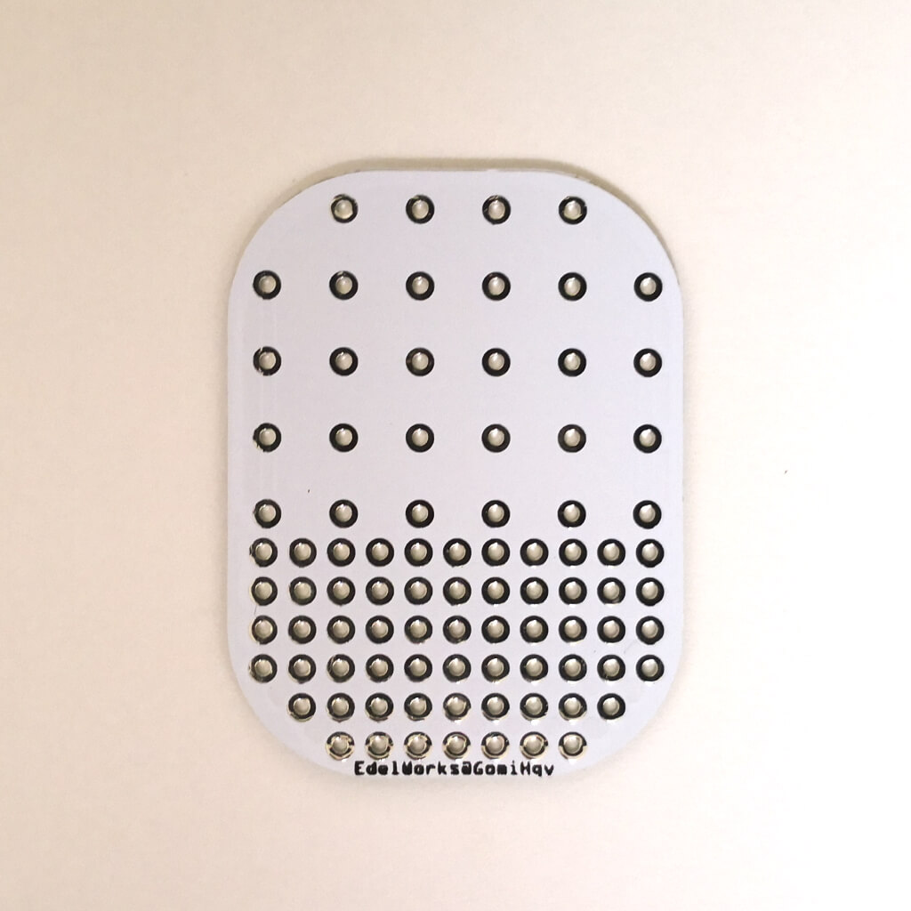

# IBBoard
アイロンビーズ用ユニバーサル基板

## 特長
5mm間隔の領域と2.54mm間隔の領域がある、アイロンビーズ用のユニバーサル基板です。

近年アイロンビーズと電子工作を組み合わせて楽しむ方が増えています。
5mm間隔のアイロンビーズにLEDを付けて光らせたり、センサーをつけてギミックに使う際、2.54mm間隔等のユニバーサル基板ではずれてしまい困ったので作りました。

左右の各列のスルーホールは繋がっており、電源やGND用の列として使うことができます。

## サイズ及び画像

IBBoard_70_50.fzz : 70×50×1mm

IBBoard_40_30.fzz : 40×30×1mm

