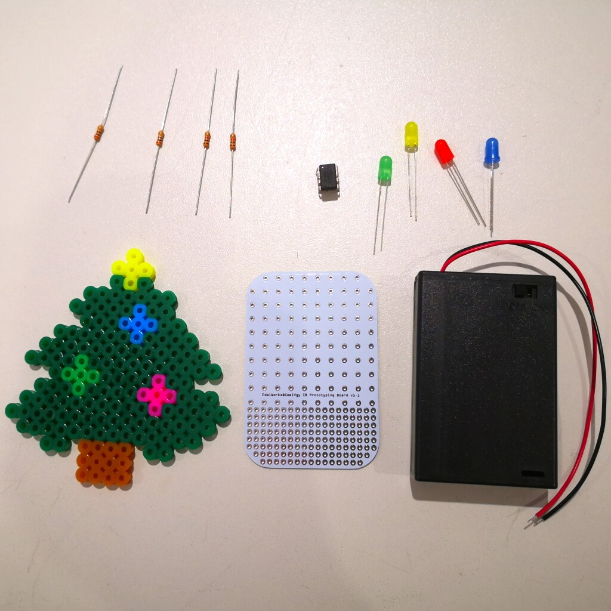
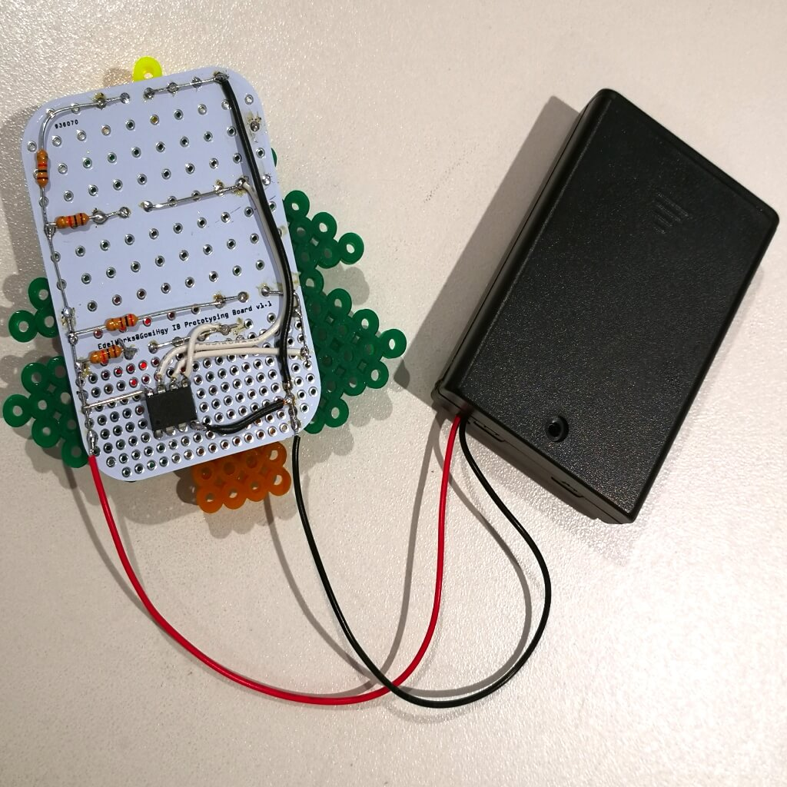
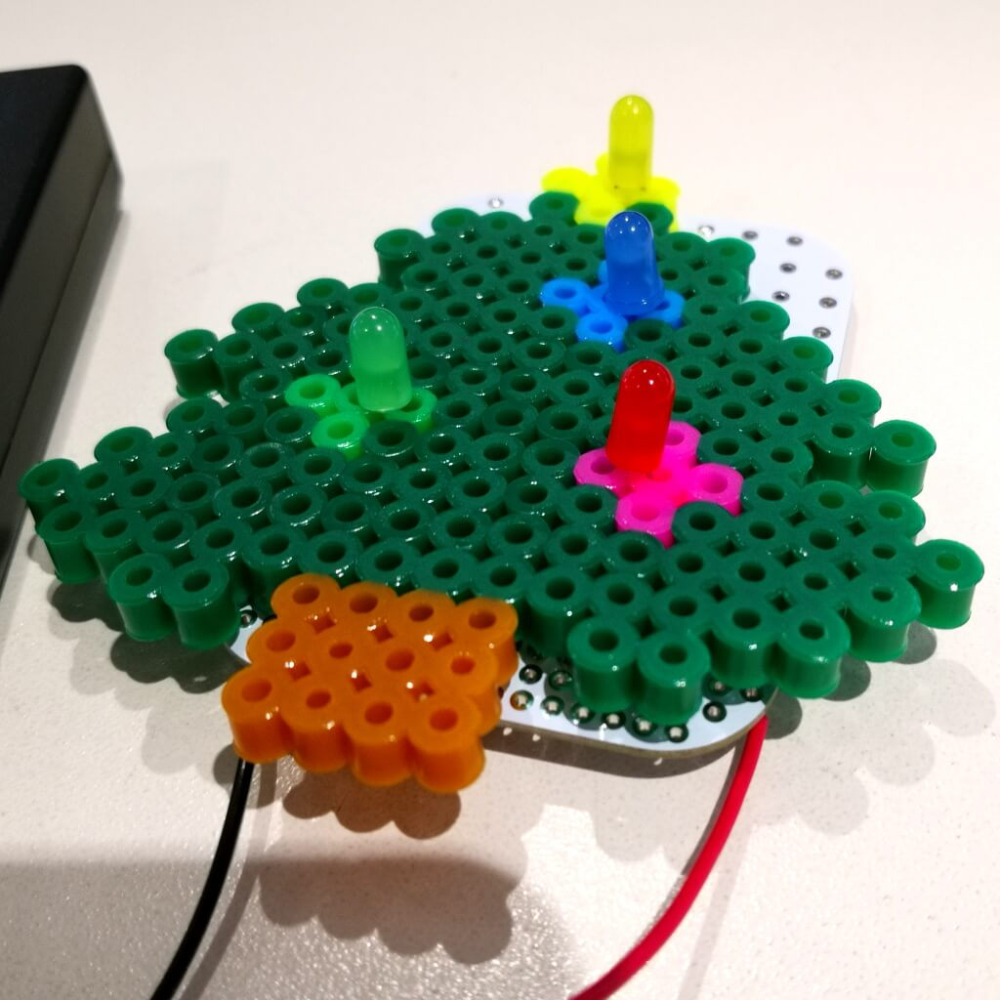
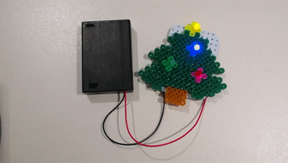

# IBBoard
アイロンビーズ用ユニバーサル基板

## 特長
5mm間隔の領域と2.54mm間隔の領域がある、アイロンビーズ用のユニバーサル基板です。

近年アイロンビーズと電子工作を組み合わせて楽しむ方が増えています。
5mm間隔のアイロンビーズにLEDを付けて光らせたり、センサーをつけてギミックに使う際、2.54mm間隔等のユニバーサル基板ではずれてしまい困ったので作りました。

左右の隅の列のスルーホールは繋がっており、電源やGND用の列として使うことができます。

## サイズ及び画像

IBBoard_70_50.fzz : 70×50×1mm

IBBoard_40_30.fzz : 40×30×1mm

## 作例

目が光る犬

### 材料
アイロンビーズの犬 
IBBoard × 1(写真は40×30mm。アイロンビーズの犬のサイズに合わせよう。) 
赤色LED × 1 
200Ω抵抗 × 1 
CR2032用コイン電池ボックス × 1(電池も準備してね！) 

### はんだ付け
IBBoardに赤色LEDと200Ω抵抗、CR2032用コイン電池ボックスをはんだ付けします。 

  IBBoardをアイロンビーズの犬に付け、コイン電池ホルダーに電池を入れたらできあがり！

クリスマスツリー 

by [@hirowo556](https://twitter.com/hirowo556)

### 材料
アイロンビーズのクリスマスツリー 
IBBoard × 1(写真は70×50mm。アイロンビーズのクリスマスツリーのサイズに合わせよう。) 
LED × 4(緑・黃・赤・青) 
200Ω抵抗 × 2(緑・青用) 
1kΩ抵抗 × 2(黃・赤用) 
単3×3電池ボックス × 1(電池も準備してね！) 
ATTiny85 × 1([このプログラム](demo/tree.ino)を書いてね！) 

### はんだ付け
[回路図](demo/tree_circuit.pdf)を参考にIBBoardにLEDと抵抗、単3×3電池ボックス、ATTiny85をはんだ付けします。 

  LEDとIBBoardでアイロンビーズのクリスマスツリーを挟みながらLEDをはんだ付けして、電池を入れたらできあがり！

